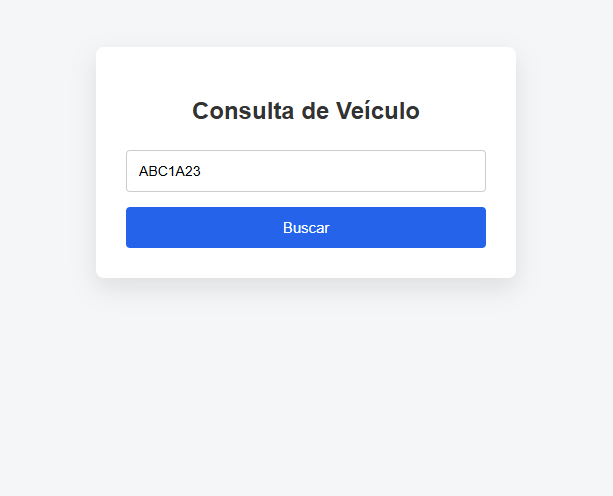
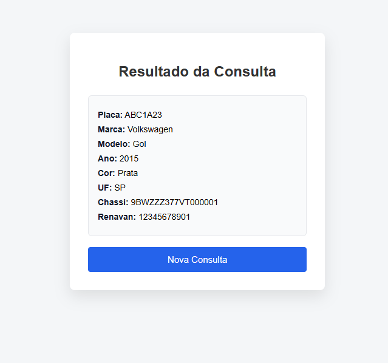

#  Sistema de Consulta Veicular

Sistema web desenvolvido em **Node.js + Express + SQL Server**, com autenticação e consulta de veículos por placa.

## Funcionalidades
- Login de usuários com validação no banco
- Consulta de veículos por placa
- Exibição detalhada dos dados do veículo
- Layout simples e responsivo
- Backend integrado a SQL Server remoto

## Tecnologias utilizadas
- Node.js
- Express
- SQL Server (MSSQL)
- HTML5 / CSS3
- JavaScript
- Git & GitHub

## Estrutura do projeto
SistemaVeicular/
│
├── db/
│ └── connection.js # Conexão e pool do SQL Server
│
├── public/
│ ├── login.html # Tela de login
│ ├── buscar.html # Tela de busca por placa/CPF
│ ├── resultado.html # Exibição dos dados do veículo
│ ├── style.css # Estilos da aplicação
│ └── script.js # JS do frontend (requisições)
│
├── server.js # Servidor Express e rotas
├── package.json # Dependências e scripts
├── package-lock.json # Lock das dependências
├── .env # Variáveis de ambiente (não versionado)
├── .gitignore # Arquivos ignorados pelo Git
└── README.md # Documentação do projeto

## Fluxo da Aplicação

1. O usuário acessa a tela de login
2. As credenciais são validadas no SQL Server
3. Após autenticação, o usuário é redirecionado para a tela de busca
4. A busca pode ser feita por placa
5. O sistema consulta o banco e retorna os dados do veículo
6. Os dados são exibidos na tela de resultado

##  Endpoints

| Método | Rota    | Descrição                  |
|------|---------|----------------------------|
| POST | /login  | Autenticação do usuário    |
| POST | /buscar | Consulta veículo por placa |

##  Boas Práticas

- Uso de parâmetros SQL (prevenção de SQL Injection)
- Pool de conexões com SQL Server
- Separação de backend e frontend
- Variáveis sensíveis protegidas em `.env`
- Código organizado por responsabilidade

##  Melhorias Futuras

- Paginação de resultados
- Logs de auditoria de consultas
- Integração com APIs externas
- Deploy em ambiente cloud

## Screenshots

